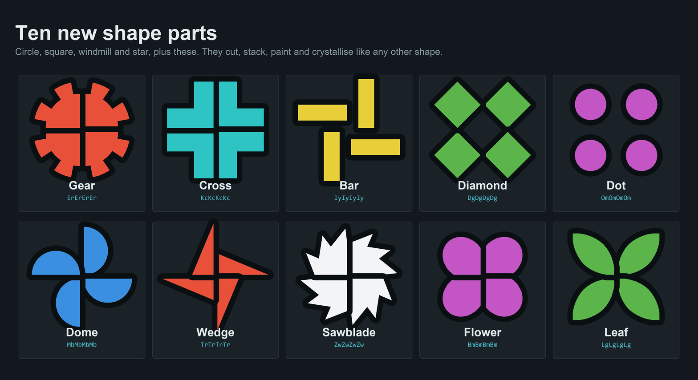
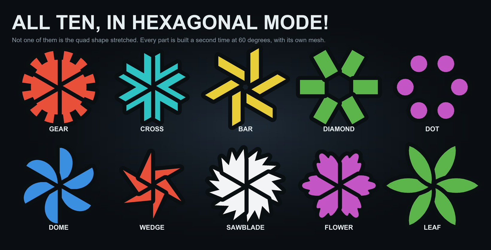
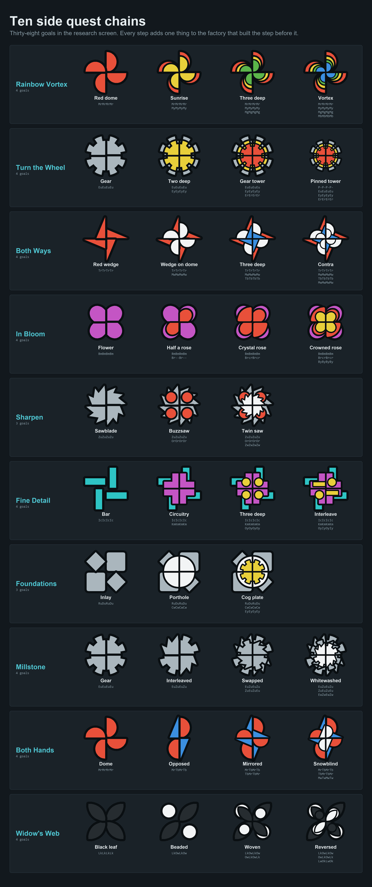
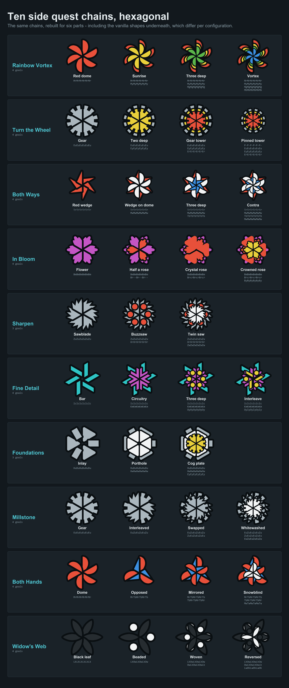

# Extra Shape Parts

shapez 2 has four shape quadrant types. This adds ten more, puts them on the map so they can
be mined rather than only built, and gives them thirty-eight side quests to be delivered to.



They cut, stack, paint, crystallise, rotate and pin exactly like the vanilla four, because the
game's shape operations never look at which part they are holding. There is nothing new to learn.

## Hexagonal mode

Every part is built again at 60 degrees, with its own mesh:



Not the quad shape stretched. `ShapeItemRenderer` rotates a part but never squashes one, so a
quadrant dropped into a six-part shape would overlap both its neighbours by 30 degrees. Two of the
parts are drawn differently at 60 degrees than at 90 for a second reason: Cross's arms thin and
Flower's petals gain teeth, so that neither collides with the hexagonal configuration's own
`RectHex` and `FlowerHex`.

## Side quests

Ten chains in the research screen, thirty-eight goals:



One rule shaped all of them — **every step adds one thing to the factory that built the step
before it.** A colour, a stacker, a pin pusher, a crystal generator. No step asks you to start a
production line from scratch.

They adapt to the mode as well, including the vanilla shapes underneath, which are not the same
shapes in a hexagonal save:



Each goal pays research points and platform capacity, on the same scale as the game's own side
tasks.

## Where the shapes come from

| | |
|---|---|
| **Rare** | Gear, Cross, Diamond, Dome, Wedge |
| **Very rare** | Bar, Dot, Sawblade, Flower, Leaf |

They turn up in shape patches on the map, in the map resource filter, and in randomly generated
operator goals — anywhere the game asks for a shape.

Worth knowing before you start a save: vanilla's rare bucket is the star and its very rare bucket
is the windmill, and each bucket is picked from evenly. Ten new parts therefore make both of those
markedly scarcer than they are without the mod.

## Shape codes

One letter each, for typing into a sandbox shape producer:

| | | | | |
|---|---|---|---|---|
| `E` Gear | `K` Cross | `I` Bar | `D` Diamond | `O` Dot |
| `M` Dome | `T` Wedge | `Z` Sawblade | `B` Flower | `L` Leaf |

None of them collide with a vanilla code in any shape configuration — including `G`, `H` and `F`,
which exist only in hexagonal mode and are easy to miss.

## Installing

Needs [Shapez Shifter](https://steamcommunity.com/sharedfiles/filedetails/?id=3542611357). Put the
mod folder in:

```
%LOCALAPPDATA%Low\tobspr Games\shapez 2\mods\ExtraShapeParts\
```

Then enable it in the game's mod list.

> **This mod affects save games.** Once one of these shapes is on your map or in a quest you have
> started, the save will not load without it — the shape code stops resolving and the save is
> refused. Start a new save, and do not remove the mod from one you care about.

Shape patches are generated with the world, so an existing save will not grow any.

## Console

The debug console (**F1**) has two commands, both aimed at anyone building on this:

| | |
|---|---|
| `esp.report` | every shape configuration's parts and rarity buckets, as they actually are, plus the renderer's authored numbers |
| `esp.dump` | writes every registered part's mesh — vanilla's included — to `<persistent>/extra-shape-parts` as `.obj`, with the vertex colours as comments |

`esp.dump` is the more useful of the two. The vanilla parts are authored assets that cannot be read
out of the assemblies, so dumping them is the only way to compare a new part against the real thing
rather than against a guess. Everything in `Screenshots/` that shows a vanilla shape is drawn from
what it wrote.

## Building it yourself

Set `SPZ2_PATH`, `SPZ2_PERSISTENT` and `SPZ2_SHIFTER` — running the game once with
`--set-modding-env-vars` does this for you — then `dotnet build`. The output goes straight to the
mods folder. Restart the game to pick up changes; a hot reload will not do, because the shape
configurations are built once per process and the parts are already in them.

`dotnet build -p:Dev=true` stages to `mods-dev` instead, since the installed copy is memory-mapped
while the game runs and cannot be overwritten.

Adding an eleventh part is a few lines in `ExtraShapePartCatalog` — an outline as a function of its
sector angle, a code, and a rarity. [DESIGN.md](DESIGN.md) records what was measured rather than
assumed, and what it cost to find out.

Built on [Shapez Shifter](https://github.com/tobspr-games/shapez2-shifter) by tobspr Games.
Licensed under [Apache 2.0](LICENSE).
