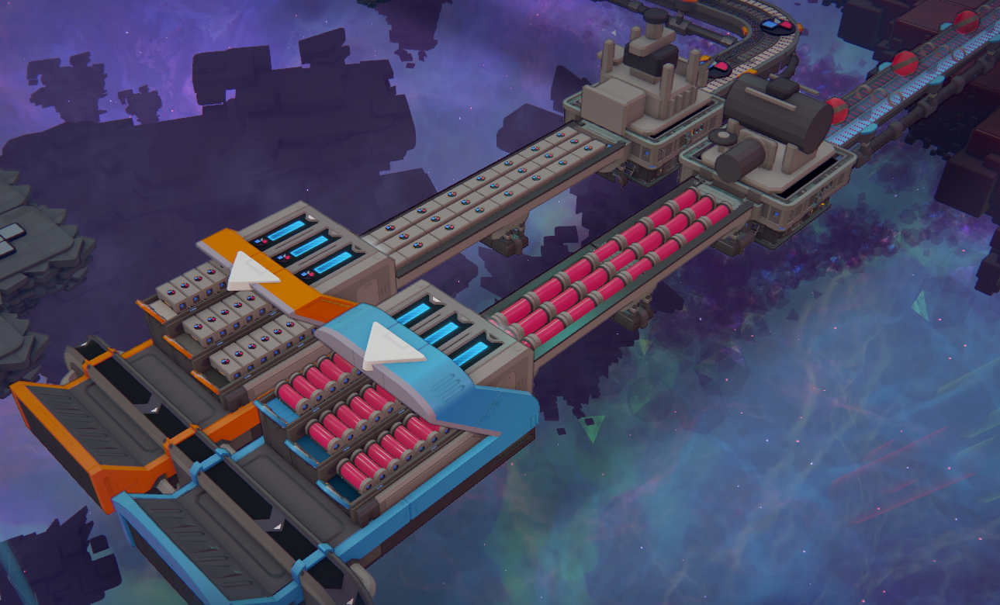
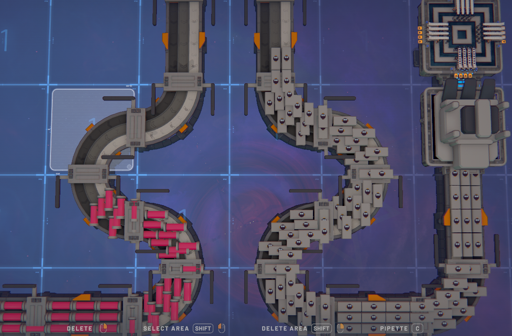
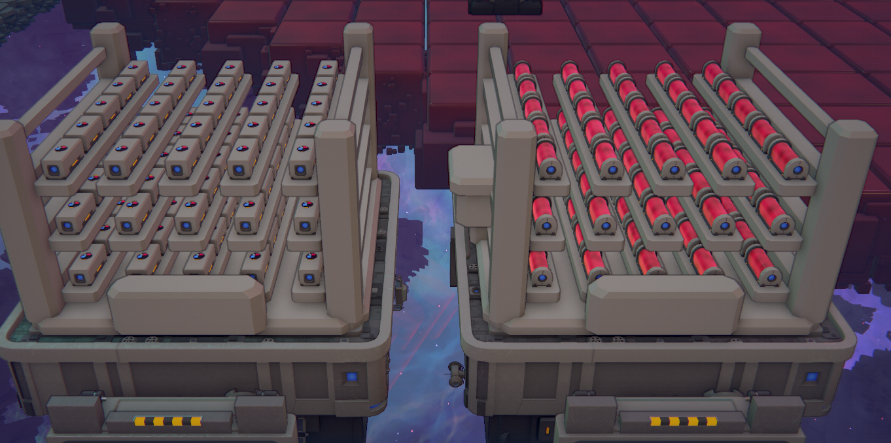

# Train Cargo Tools

Trains already move shapes and fluids in dense containers. This mod lets you do the same
thing off the rails.



Pack shapes or fluids into the game's own cargo containers, carry them on a cargo belt,
buffer them in a cargo store, and unpack them where you need them. Train stations take the
containers straight from a belt, so a station stops being the only place cargo exists.

## The buildings

Everything is in the **Train Cargo** group on the hotbar, and each building has a wiki page
in game.

| | |
|---|---|
| **Shape Cargo Packager** | 360 shapes in, one container out |
| **Fluid Cargo Packager** | 60 fluid in, one container out |
| **Shape / Fluid Cargo Unpackager** | a container back onto a space belt or space pipe |
| **Cargo Belt** | carries containers, three abreast, one file per floor |
| **Cargo Store** | 75 containers — 25 per floor, any mix of types |

## Why it is worth the research

A cargo belt runs at a fifth of a space belt's speed and uses one lane per floor rather than
four. It still moves far more, because a slot carries 360 shapes instead of one:

| | Space belt | Cargo belt |
|---|---|---|
| Carrying lanes per chunk | 4 × 3 floors = 12 | 1 × 3 floors = 3 |
| Speed | R | R / 5 |
| Payload per slot | 1 shape | 360 |
| **Shapes past a point** | 12R | **216R** |

About **18×**, then. Buffering is a bigger jump still: a chunk of cargo belt holds 4,320
shapes against a space belt's 192.

**Fluid is not the same number.** A fluid package holds 60, not 360, so a fluid cargo belt
is about **3×** a space pipe. Worth knowing before repeating the shape figure.

## Belts



Drag them like a space belt. Corners, junctions and lifts are chosen and placed for you, the
same way the game places belt corners — none of them is in the hotbar.

- A **junction** appears where a line branches: one belt in, two or three out, with the
  containers split evenly between the routes leading away from it.
- A **lift** appears where a line has to climb: one or two floors, up or down, in any of the
  four directions including a hairpin back the way it came.

Cargo belts only talk to other cargo machines. They will **not** accept input from a space
belt or a space pipe, so a line cannot be fed by accident.

## Stores



75 containers, 25 on each floor, and shapes and fluid can sit in the same store. Put one
between a packager and a station and the station never waits.

## Research

Two nodes in the trains group, 4.8k points each:

| | |
|---|---|
| **Cargo Machines** | packagers, unpackagers, cargo belts |
| **Cargo Stores** | the store |

## Installing

Needs [Shapez Shifter](https://steamcommunity.com/sharedfiles/filedetails/?id=3542611357).
Put the mod folder in:

```
%LOCALAPPDATA%Low\tobspr Games\shapez 2\mods\TrainCargoTools\
```

**This mod affects save games.** Once it is installed to a save you cannot load that save
without it, because the containers on your belts and in your stores are its state.

## Building it yourself

Set `SPZ2_PATH`, `SPZ2_PERSISTENT` and `SPZ2_SHIFTER` — running the game once with
`--set-modding-env-vars` does this for you — then `dotnet build`. The output goes straight
to the mods folder, so close the game first: the installed dll is memory-mapped while it
runs and the copy fails with `MSB3027`.

`dotnet build -p:Dev=true` stages to `mods-dev` instead, which is safe while the game is
open, though nothing loads from there without the Mod Reloader.

Track meshes are generated rather than modelled. `python Tools/generate_meshes.py` rebuilds
every belt, corner, junction and lift in `TrainCargoTools/Resources/`; the lift ramp gradient
and the path cargo travels are two expressions of the same numbers, so change one and check
the other. `DESIGN.md` records what is verified about the game's own behaviour and which
class or method proves it.

The debug console (**F1**) has a few art commands: `cargotools.dumplift` prints the lift
definitions the game asked for, and `cargotools.dumpicons`, `cargotools.dumpatlas`,
`cargotools.palette` and `cargotools.uv` dump what the drawers are working from.

Built on [Shapez Shifter](https://github.com/tobspr-games/shapez2-shifter) by tobspr Games.
Licensed under [Apache 2.0](LICENSE).
